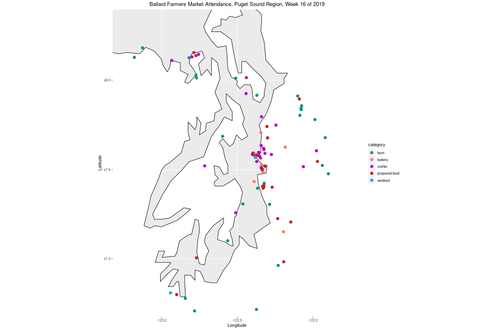
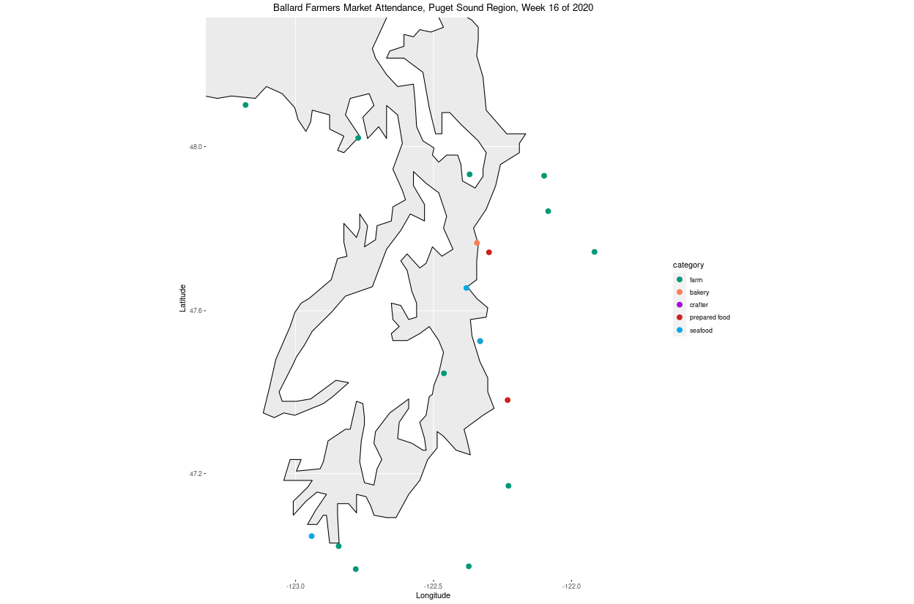
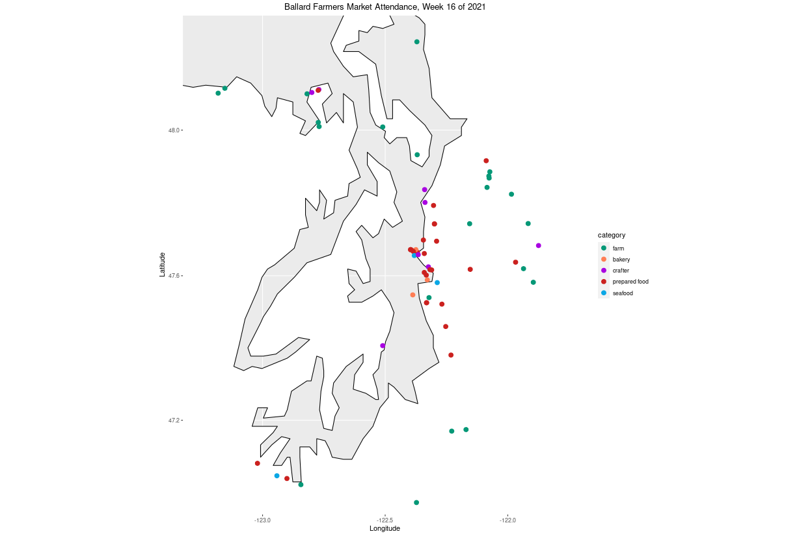
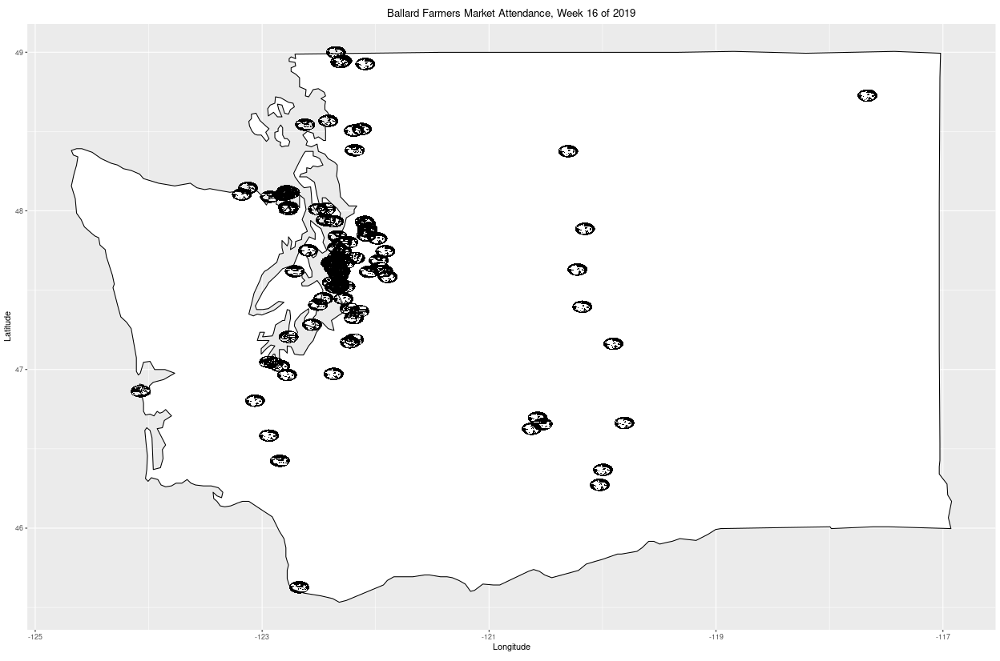
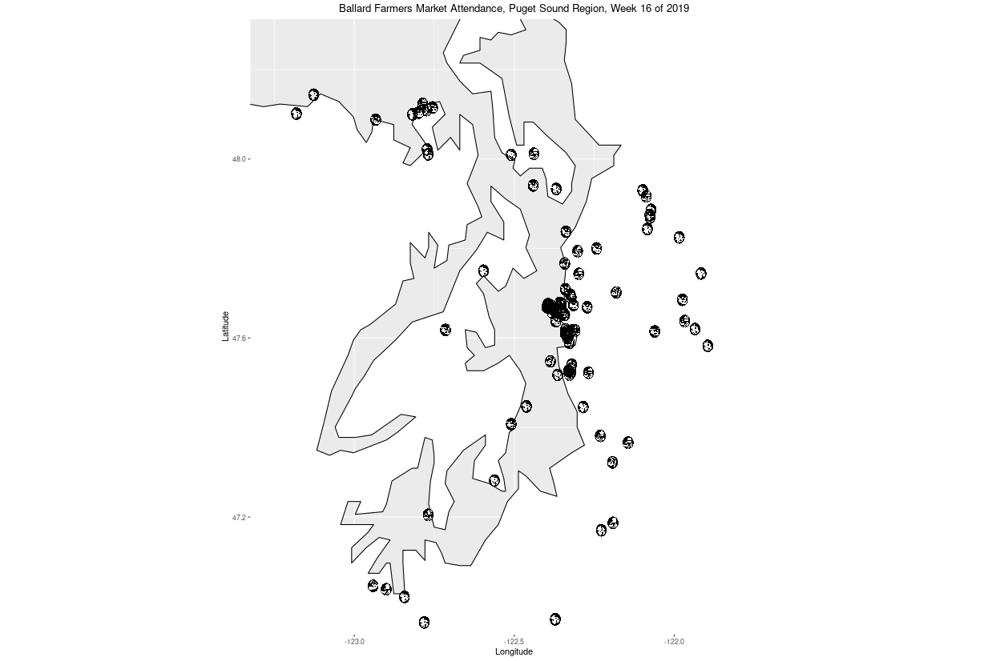

# Farm maps

Generating maps showing which farms/vendors that sold at the Ballard Farmers Market in 2019, 2020, and 2021.

## Maps by color

Maps with each vendor category as a colored dot.

### 2019

### 2020

### 2021

## Maps by icon

Maps with each vendor category as an imported icon file. The icons need redesign to be more aesthetically intuitive (different colors, resizing, changing the aspect ratio, etc).

### 2019

### 2020

### 2021

